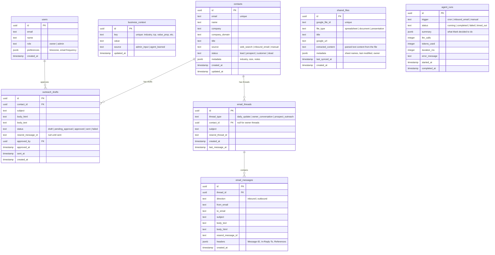

# Mark: Email-First AI Sales & Marketing Agent

## Overview

Mark is an AI-powered sales and marketing agent that runs on a daily cron job, researches leads via web search, drafts outreach emails for owner approval, and communicates with the business owner via two-way email. The pilot deployment is for VPAK.com, a small B2B company.

The primary user (dad) interacts with Mark entirely through email. An admin (Ryan) manages Mark through a minimal web dashboard. Mark accumulates business knowledge over time in Supabase and uses Claude Sonnet 4.5 for reasoning.

## Problem Statement

VPAK.com lost its sales/marketing partner and now has a single operator who handles everything. There is no one doing outbound prospecting, follow-ups, or lead research. The operator checks email regularly but is unlikely to adopt a new app or dashboard — any solution must meet him where he already is.

## Proposed Solution

An autonomous email agent ("Mark") that:
1. Runs daily via Vercel Cron, deciding what's most useful to surface
2. Sends the owner a daily email with leads, draft outreach, and follow-up reminders
3. Processes owner replies via inbound email webhook (Resend)
4. Sends approved outreach to prospects from `mark@vpak.com`
5. Forwards prospect replies to the owner immediately
6. Builds a growing knowledge base in Supabase

(See brainstorm: `docs/brainstorms/2026-03-28-mark-sales-agent-brainstorm.md` for approach selection rationale — email-first was chosen over web-chat-first and hybrid approaches for lowest user friction.)

## Technical Approach

### Architecture

```
                    +-----------------+
                    | Vercel Cron     |
                    | (daily trigger) |
                    +--------+--------+
                             |
                             v
                    +--------+--------+
                    | /api/cron/daily |
                    | (agent loop)    |
                    +--------+--------+
                             |
              +--------------+--------------+
              |              |              |
              v              v              v
        +-----+----+  +-----+----+  +------+-----+
        | Claude   |  | Web      |  | Supabase   |
        | Sonnet   |  | Search   |  | (knowledge |
        | (reason) |  | (leads)  |  |  base)     |
        +-----+----+  +----------+  +------+-----+
              |                            |
              v                            |
        +-----+----+                       |
        | Resend   | <---------------------+
        | (send    |   (read contacts,
        |  email)  |    conversation history)
        +-----+----+
              |
     +--------+--------+
     |                  |
     v                  v
+----+------+    +------+-------+
| Daily     |    | Outreach     |
| email to  |    | to prospect  |
| owner     |    | (if approved)|
+----+------+    +------+-------+
     |                  |
     v                  v
(owner replies)   (prospect replies)
     |                  |
     v                  v
+----+-----------------+----+
|  /api/email/inbound       |
|  (Resend webhook)         |
+----+-----------+----------+
     |           |
     v           v
  Owner       Prospect
  routing     routing
     |           |
     v           v
  Process &   Forward to
  respond     owner + log
```

### Tech Stack

| Layer | Choice | Rationale |
|-------|--------|-----------|
| Framework | Next.js 16 | Already scaffolded (see brainstorm) |
| Database + Auth | Supabase | Multi-user, RLS, realtime (see brainstorm) |
| LLM (reasoning) | Claude Sonnet 4.5 | Best price/performance for agentic loops (see brainstorm) |
| LLM (simple tasks) | Claude Haiku 4.5 | Email classification, simple replies |
| Email | Resend | Best Vercel integration, inbound webhooks, threading via Chat SDK adapter |
| Web Search | Tavily or Serper | Structured search results for lead research |
| Google Files | Google Drive/Sheets/Docs API | Owner shares files to give Mark business context |
| Cron | Vercel Cron Jobs | Native, no external service needed |
| Deployment | Vercel (Pro) | 300s function timeout required for agent loop |

### Implementation Phases

#### Phase 1: Foundation (Infrastructure + Core Loop)

Set up the database, auth, email, and a working agent loop that sends a daily email.

**1.1 Project Setup**
- [ ] Run `npm install` and verify Next.js 16 docs at `node_modules/next/dist/docs/`
- [ ] Install dependencies: `@anthropic-ai/sdk`, `@supabase/supabase-js`, `resend`, `zod`, `googleapis`
- [ ] Set up `.env.local` with: `ANTHROPIC_API_KEY`, `SUPABASE_URL`, `SUPABASE_ANON_KEY`, `SUPABASE_SERVICE_ROLE_KEY`, `RESEND_API_KEY`, `CRON_SECRET`, `GOOGLE_CLIENT_ID`, `GOOGLE_CLIENT_SECRET`
- [ ] Configure `vercel.json` with cron schedule
- [ ] Set up Resend custom domain for `mark@vpak.com` (DNS: SPF, DKIM, DMARC)

**1.2 Supabase Schema**



- [ ] Create Supabase project and apply migrations for all tables above
- [ ] Set up Row Level Security: owners see their business data, admins see everything
- [ ] Create `src/lib/supabase/client.ts` (browser client) and `src/lib/supabase/server.ts` (server client with service role)

**1.3 Agent Core**
- [ ] Create `src/lib/agent/mark.ts` — the main agent loop using Claude SDK `toolRunner`
- [ ] Define Mark's system prompt in `src/lib/agent/system-prompt.ts` — persona, rules, business context injection
- [ ] Create agent tools (`src/lib/agent/tools/`):
  - `get-business-context.ts` — read business context from Supabase
  - `get-pending-followups.ts` — query contacts needing follow-up
  - `search-leads.ts` — web search via Tavily/Serper API
  - `save-lead.ts` — store discovered lead in contacts table (with dedup by email/domain)
  - `draft-outreach.ts` — create an outreach draft in `outreach_drafts` table
  - `get-conversation-history.ts` — fetch recent email messages for context
  - `read-shared-file.ts` — read content from a Google Drive file shared with Mark
- [ ] Add time budget guard: if approaching 270s, force the agent to wrap up
- [ ] Add iteration cap: max 15 LLM calls per cron run
- [ ] Add cost tracking: log `tokens_used` and `llm_calls` to `agent_runs`

**1.4 Daily Cron Route**
- [ ] Create `src/app/api/cron/daily/route.ts`
- [ ] Verify cron secret (`Authorization: Bearer <CRON_SECRET>`)
- [ ] Load business context and pending state from Supabase
- [ ] Run Mark's agent loop with context
- [ ] Compose daily email from agent output
- [ ] Send via Resend to the owner's email address
- [ ] Log the run to `agent_runs` table
- [ ] On failure: log error, send a simple "Mark encountered an issue" email to admin

**1.5 Daily Email Format**
- [ ] Create email template (`src/lib/email/templates/daily-update.tsx` using React Email)
- [ ] Sections (ordered by priority):
  1. Prospect replies (if any) — highest urgency
  2. Follow-up reminders — "You should reach out to X today because Y"
  3. New leads found — brief summary with why they're relevant
  4. Draft outreach for approval — full email text, reply "APPROVE 1" / "APPROVE ALL" / "EDIT 1: [changes]"
  5. What Mark learned today — new business context accumulated
- [ ] Include at bottom: "Reply to this email to talk to Mark"
- [ ] Each daily email starts a new thread (new `Message-ID`, no `In-Reply-To`)
- [ ] Cap at 5 items per section to prevent overwhelming emails

#### Phase 2: Two-Way Email (Inbound Processing + Outreach Sending)

Enable the owner to reply to Mark and approve outreach.

**2.1 Inbound Email Webhook**
- [ ] Create `src/app/api/email/inbound/route.ts`
- [ ] Verify Resend webhook signature on every request (security requirement — not optional)
- [ ] Fetch full email body via Resend Received Emails API (webhook only contains metadata)
- [ ] Implement email routing (`src/lib/email/router.ts`):

```
Inbound email to mark@vpak.com
  |
  +-- Match sender against owner email(s) → OWNER flow
  |     |
  |     +-- Contains approval keywords (APPROVE, EDIT, REJECT) → Approval flow
  |     +-- Otherwise → Conversational reply flow
  |
  +-- Match sender against known contacts → PROSPECT flow
  |     |
  |     +-- Forward to owner immediately
  |     +-- Log in knowledge base
  |     +-- Include in next daily email
  |
  +-- Auto-reply / bounce / out-of-office detection → DISCARD (log only)
  |
  +-- Unknown sender → LOG and ignore (don't process as command)
```

- [ ] Strip email signatures and quoted text before processing (use a library like `plancklabs/mailstrip` or regex-based stripping)
- [ ] Return 200 immediately, process in `after()` callback (per Envirocon webhook pattern)

**2.2 Owner Reply Processing**
- [ ] Parse owner reply text (stripped of signatures/quotes)
- [ ] For conversational replies: run Mark's agent loop with the reply as context, send response email maintaining thread (`In-Reply-To` + `References` headers)
- [ ] For approval commands: parse with keyword matching first (not LLM) — "APPROVE 1", "APPROVE ALL", "REJECT 3", "EDIT 2: [new text]"
- [ ] Fall back to Haiku for ambiguous replies ("yeah send it" → classify as approval + identify which draft)
- [ ] Use claim-once semantics for approvals: set `status = 'approved'` atomically in a Supabase transaction, reject if already approved/sent (prevents double-send on webhook retry)

**2.3 Outreach Sending**
- [ ] When a draft is approved: send via Resend from `mark@vpak.com`
- [ ] Set proper threading headers (new thread per prospect)
- [ ] From name: "Mark | VPAK" (transparent that it's an assistant, not deceptive)
- [ ] Include CAN-SPAM compliance footer: physical mailing address + unsubscribe link
- [ ] Update `outreach_drafts.status` to `'sent'`, store `resend_message_id`
- [ ] Track in `email_messages` table for conversation history
- [ ] Implement unsubscribe webhook: when prospect clicks unsubscribe, update contact status to `'dead'` and never email them again

**2.4 Prospect Reply Handling**
- [ ] When a prospect replies to outreach: immediately forward the full reply to the owner's email
- [ ] Log the reply in `email_messages` and update contact status
- [ ] Include in the next daily email summary with context
- [ ] Do NOT auto-respond to prospects — the owner handles real conversations
- [ ] If prospect replies with unsubscribe language ("stop", "unsubscribe", "remove me"), auto-process as opt-out

#### Phase 3: Admin Dashboard + Onboarding

Minimal web UI for configuration and monitoring.

**3.1 Authentication**
- [ ] Set up Supabase Auth with email/password login
- [ ] Create `src/middleware.ts` for auth session management
- [ ] Protect all dashboard routes behind auth
- [ ] Seed initial users: owner (dad) + admin (Ryan)

**3.2 Onboarding Flow (Bootstrapping)**
- [ ] Create `/onboard` page — the Day 0 experience before Mark can be useful
- [ ] Structured form for business context:
  - Business name and description
  - Industry / vertical
  - Ideal Customer Profile (ICP): company size, industry, geography, job titles
  - Value proposition: what makes VPAK different
  - Owner's email address (for daily emails)
  - Owner's name and title (for email personalization)
  - Any existing key customers or contacts to seed
  - Google Drive files to share (customer lists, company docs, pricing sheets)
- [ ] Store in `business_context` table with `source: 'admin_input'`
- [ ] Mark cannot run the daily cron until onboarding is complete (guard in cron route)

**3.3 Google File Sharing**
- [ ] Implement Google OAuth2 flow for Drive read access (scope: `drive.readonly`)
- [ ] Create `src/lib/google/drive.ts` — client for reading shared files
- [ ] Create `src/lib/google/parser.ts` — extract text content from:
  - Google Sheets → parse rows/columns into structured text (customer lists, contact info, pricing)
  - Google Docs → extract full document text (proposals, notes, company info)
  - PDFs in Drive → extract text content
- [ ] `/dashboard/files` — UI to paste a Google Drive link or browse shared files
- [ ] Store file references in `shared_files` table with extracted content
- [ ] Re-sync shared files on each cron run (check `last_synced_at`, re-extract if file modified since)
- [ ] Mark's agent tools can read `shared_files.extracted_content` for business context
- [ ] Owner can also share files by forwarding/emailing Google links to Mark — inbound email router detects Google Drive URLs and auto-imports

**3.4 Dashboard Pages**
- [ ] `/dashboard` — overview: last agent run status, emails sent today, pending approvals
- [ ] `/dashboard/activity` — agent run log: list of `agent_runs` with status, summary, duration
- [ ] `/dashboard/contacts` — contact/lead table: name, email, company, status, last interaction
- [ ] `/dashboard/outreach` — outreach draft queue: draft text, status, approval history
- [ ] `/dashboard/settings` — business context editor, owner email config, timezone, cron schedule
- [ ] `/dashboard/knowledge` — what Mark has learned (business context entries with `source: 'agent_learned'`)

**3.5 Daily Email Preview**
- [ ] `/dashboard/preview` — render the next daily email as it would look, before it sends
- [ ] Manual "Send Now" button to trigger a cron run outside the schedule

#### Phase 4: Hardening + Observability

Production readiness.

**4.1 Error Handling & Alerting**
- [ ] Wrap all agent runs in try/catch with structured error logging to `agent_runs`
- [ ] On cron failure: send error notification email to admin (not the owner)
- [ ] On email send failure: retry once, then log as failed and alert admin
- [ ] Monitor Resend webhook delivery: if no webhooks received for 24h, something is wrong
- [ ] Validate LLM output before using it (per global learnings): check that generated emails have subject + body, outreach targets exist in contacts table
- [ ] Add Vercel function `maxDuration = 300` to cron and webhook routes

**4.2 Rate Limiting & Cost Controls**
- [ ] Per cron run: max 15 LLM calls, max 5 web searches, max 10 draft outreaches
- [ ] Daily budget: track cumulative tokens across all runs, pause if exceeding threshold ($5/day default)
- [ ] Per prospect: max 1 outreach per 7 days (prevent spam)
- [ ] Log all costs to `agent_runs` for dashboard visibility

**4.3 Security**
- [ ] Resend webhook signature verification (Phase 2.1 — critical)
- [ ] Cron secret verification (Phase 1.4)
- [ ] Supabase RLS policies on all tables
- [ ] Rate limit the inbound webhook endpoint (prevent abuse)
- [ ] Never log full email bodies in plain text logs (PII)
- [ ] Sanitize all LLM output before inserting into emails (prevent injection)

## Alternative Approaches Considered

1. **Web chat first** — rejected because the primary user (dad) checks email, not web apps. Would require behavior change. (See brainstorm for full rationale.)
2. **Gmail API direct integration** — would let Mark read/send from dad's own inbox. Rejected: more complex auth (OAuth + domain-wide delegation), mixes Mark's messages with personal email, harder to separate concerns.
3. **AgentMail** — purpose-built email platform for AI agents. Strong conceptual fit but very new (launched Aug 2025, $6M raised Mar 2026). Worth watching as an upgrade path if Resend's inbound proves limiting.
4. **SMS-based** — considered but email has more room for structured content (lead details, draft previews). SMS better as a future notification channel.

## System-Wide Impact

### Interaction Graph

```
Vercel Cron → /api/cron/daily → Mark agent loop → Claude API (5-15 calls)
                                                 → Tavily/Serper (1-5 searches)
                                                 → Supabase (10-20 queries)
                                                 → Resend (1 daily email + 0-5 outreach)

Resend Webhook → /api/email/inbound → Email router → Owner path → Mark agent loop → Resend (reply)
                                                    → Prospect path → Resend (forward to owner)
                                                    → Approval path → Supabase (update draft) → Resend (send outreach)
```

### Error Propagation

- Claude API failure → agent loop aborts → cron run logged as `failed` → admin notified
- Resend API failure → email not sent → retry once → log as `failed` → admin notified
- Supabase failure → agent can't read/write knowledge → agent loop aborts → admin notified
- Webhook processing failure → return 200 (prevent Resend retry storm) → log error → admin notified
- Web search failure → non-fatal, agent continues without new leads

### State Lifecycle Risks

- **Double approval**: Owner's "APPROVE" email is retried by webhook → outreach sends twice. **Mitigation**: claim-once flag in DB transaction.
- **Orphaned drafts**: Agent creates draft but cron times out before emailing owner → draft exists but owner never sees it. **Mitigation**: next cron run picks up orphaned drafts.
- **Stale context**: Knowledge base updated mid-agent-loop → agent uses partially stale data. **Mitigation**: acceptable for daily cadence; agent reads context once at loop start.

## Acceptance Criteria

### Functional Requirements

- [ ] Daily cron runs and sends a daily email to the owner with actionable content
- [ ] Owner can reply to Mark's email and get a response maintaining the thread
- [ ] Owner can approve outreach by replying with "APPROVE [number]"
- [ ] Approved outreach sends from `mark@vpak.com` with proper threading
- [ ] Prospect replies are forwarded to the owner immediately
- [ ] Mark discovers new leads via web search and stores them in the knowledge base
- [ ] Knowledge base grows over time with contacts, context, and conversation history
- [ ] Admin can log in and see Mark's activity, contacts, and settings
- [ ] Onboarding flow collects business context before Mark starts
- [ ] Owner can share Google files (Sheets, Docs) with Mark to provide business context
- [ ] Shared files are re-synced automatically and their content is available to Mark's reasoning

### Non-Functional Requirements

- [ ] Agent loop completes within 270s (leaving 30s buffer for Vercel's 300s limit)
- [ ] Daily email sends by the configured time (within 5 min tolerance)
- [ ] Inbound email replies processed within 60s of receipt
- [ ] Outreach emails include CAN-SPAM compliant footer
- [ ] All webhook endpoints verify signatures/secrets
- [ ] Agent runs logged with cost tracking (tokens, duration, LLM calls)
- [ ] Admin notified within 5 min of any critical failure

### Quality Gates

- [ ] Webhook signature verification has unit tests
- [ ] Approval flow has tests for double-execution prevention
- [ ] Email routing has tests for all sender types (owner, prospect, unknown, bounce)
- [ ] Agent loop has integration test with mocked Claude API
- [ ] Supabase RLS policies tested for both owner and admin roles

## Success Metrics

- Mark sends a useful daily email within 1 week of setup
- Owner replies to at least 3 daily emails in the first 2 weeks (engagement)
- At least 5 outreach emails approved and sent in the first month
- Knowledge base grows to 20+ contacts within the first month
- Zero unapproved outreach emails sent (approval flow integrity)

## Dependencies & Prerequisites

- **Vercel Pro plan** — required for 300s function timeout (hobby is 60s)
- **Resend account** — with custom domain verified for `vpak.com`
- **Supabase project** — free tier sufficient for pilot
- **Anthropic API key** — with sufficient credits (~$5/month estimated)
- **Web search API key** — Tavily ($0 free tier, 1000 searches/month) or Serper
- **DNS access for vpak.com** — to add Resend SPF/DKIM/DMARC records

## Risk Analysis & Mitigation

| Risk | Impact | Likelihood | Mitigation |
|------|--------|------------|------------|
| Dad doesn't engage with daily emails | Product fails | Medium | Start with short, high-value emails. Iterate on format based on feedback. Add voice later. |
| Claude API credits deplete silently | Agent stops working | Medium | Daily cost tracking + admin alert when balance low |
| Outreach marked as spam by recipients | Reputation damage | Medium | Low volume, personalized content, proper SPF/DKIM, unsubscribe link |
| Vercel function timeout on complex agent runs | Daily email fails to send | Medium | Time budget guard, iteration cap, break into smaller runs if needed |
| Resend inbound webhook unreliable | Owner replies lost | Low | Log all webhook events, monitor for gaps, alert if no webhooks in 24h |
| LLM generates inappropriate outreach | Reputation damage | Low | Owner approves every outreach, validate output structure before presenting |

## Future Considerations

These are explicitly deferred from v1 (see brainstorm):
- Voice chat in browser (WebRTC + Claude voice API)
- Google Meet / phone call integration
- Social media posting (LinkedIn)
- Content creation (newsletters, blog posts)
- Full CRM with pipeline management
- Google Chat or SMS as additional channels
- AgentMail migration if email complexity grows

## Sources & References

### Origin

- **Brainstorm document:** [docs/brainstorms/2026-03-28-mark-sales-agent-brainstorm.md](docs/brainstorms/2026-03-28-mark-sales-agent-brainstorm.md) — Key decisions carried forward: email-first approach, Claude API for reasoning, dad approves all outreach, custom VPAK domain, web search for lead discovery.

### Internal References

- **Envirocon webhook pattern:** SMS webhook with `after()` async processing — same pattern for email inbound
- **Envirocon cron pattern:** Vercel Cron with `verifyCronSecret()` + Sentry monitoring
- **Global learnings:** Claim-once semantics, LLM hallucination guards, async sequencing, output validation

### External References

- Resend inbound email docs: https://resend.com/docs/dashboard/receiving/introduction
- Resend Vercel Chat SDK adapter (threading): https://resend.com/changelog/resend-adapter-vercel-chat-sdk
- Anthropic tool use docs: https://docs.anthropic.com/en/docs/build-with-claude/tool-use
- Anthropic prompt caching: https://docs.anthropic.com/en/docs/build-with-claude/prompt-caching
- CAN-SPAM compliance: https://www.ftc.gov/business-guidance/resources/can-spam-act-compliance-guide-business

### Key Technical Decisions

- **Resend over SendGrid/Postmark** — best Vercel integration, first-class threading, free tier includes inbound
- **Claude Sonnet 4.5 for agent loop, Haiku 4.5 for classification** — cost tiering per global learnings
- **`toolRunner` helper over manual loop** — less boilerplate, switch to manual only if per-iteration logic needed
- **Keyword matching for approvals, not LLM** — prevents hallucinated confirmations per global learnings
- **Prompt caching** — system prompt + business context cached across iterations (90% cost reduction on reads)
